<h1 align="center">✨ Siamese Convolutional Neural Network ✨</h1>

<h6 align="center"><em>Deep learning model for one-shot image recognition</em></h6>

## 📝 Overview

This project implements a Siamese neural network architecture designed for similarity-based recognition tasks. Siamese networks are particularly valuable when working with limited labeled data or when the goal is to determine if two inputs are similar rather than classifying inputs into fixed categories.

### Key Applications
- **Facial Verification**: Determining if two face images belong to the same person
- **Signature Verification**: Authenticating signatures by comparing with known samples
- **One-Shot Learning**: Recognizing objects from just one or a few examples
- **Anomaly Detection**: Identifying unusual patterns by comparing with normal examples

### How It Works

The Siamese architecture consists of twin neural networks that share identical weights. When presented with two different inputs:

1. Each input passes through the same embedding network
2. The resulting embeddings are compared using an L1 distance metric
3. A final layer determines the similarity score (0-1) between the inputs
4. The network learns to output values closer to 1 for similar pairs and values closer to 0 for dissimilar pairs

This approach effectively transforms the recognition problem into a similarity learning task, making it more efficient for scenarios where collecting large amounts of labeled data for each class is impractical.

## 🔢 Mathematical Foundation

### Data Preprocessing
Image scaling is performed using:

```math
X_{scaled} = \frac{X}{255}
```

**Where**

- $X$ is the input image pixel matrix values

**And**

```math
X \in \mathbb{R}^{100 \times 100 \times 3}
```

- $100$ is the height (number of rows)
- $100$ is the width (number of columns)
- $3$ is the constant number of channels **(RGB)**

Each pixel at position $(i, j)$ is a vector:

```math
X_{i,j} = \begin{bmatrix} R & G & B \end{bmatrix}
```

Here's a representation of what this looks like:
```python
[[[  0  61  82]
  [  2  63  81]
  [  1  64  79]
  ...
  [  0   0   0]
  [  0   0   0]
  [  0   1   0]]

 [[  2  64  83]
  [  2  64  81]
  [  1  64  78]
  ...
  [  0   0   0]
  [  0   1   0]
  [  1   1   1]]

 ...

 [[  0   1   0]
  [  0   0   0]
  [  0   0   0]
  ...
  [ 34  22  62]
  [ 35  24  63]
  [ 37  24  64]]]
```

### Siamese Network Architecture

The Siamese network consists of twin networks that share weights. This architecture is particularly useful for similarity learning, verification tasks, and one-shot learning.

#### Embedding Network

_**Input Layer:**_

The input layer receives an RGB image with dimensions:

```math
X \in \mathbb{R}^{100 \times 100 \times 3}
```

_**Conv2D Layers:**_

The network employs a series of convolution operations followed by max pooling to extract hierarchical features.

**First Convolutional Block:**

```math
f_1(\mathbf{X}) = \text{ReLU}(\mathbf{W}_1 * \mathbf{X} + \mathbf{b}_1)
```

**Where:**
- $\mathbf{W}_1 \in \mathbb{R}^{10 \times 10 \times 3 \times 64}$ is the kernel matrix
- $\mathbf{b}_1$ is the bias term

The convolution operation can be expressed as:

```math
f_1(X) = \text{ReLU}(\sum_{m=0}^{10-1}\sum_{n=0}^{10-1}\sum_{c=0}^{3-1}x_{i+m,j+n,c}\cdot w_{m,n,c,k}+b_k)
```

**First Max Pooling:**

```math
\text{pool}_1(f_1)(m,n) = \max\limits_{(i,j)\in W_{m,n}}f_1(i,j)
```

With a pool size of $2 \times 2$ and padding set to 'same'.

**Second Convolutional Block:**

```math
f_2(\text{pool}_1) = \text{ReLU}(\mathbf{W}_2 * \text{pool}_1(f_1) + \mathbf{b}_2)
```

**Where:**
- $\mathbf{W}_2 \in \mathbb{R}^{7 \times 7 \times 64 \times 128}$ is the kernel matrix
- $\mathbf{b}_2$ is the bias term

**Second Max Pooling:**

```math
\text{pool}_2(f_2)(m,n) = \max\limits_{(i,j)\in W_{m,n}}f_2(i,j)
```

**Third Convolutional Block:**

```math
f_3(\text{pool}_2) = \text{ReLU}(\mathbf{W}_3 * \text{pool}_2(f_2) + \mathbf{b}_3)
```

**Where:**
- $\mathbf{W}_3 \in \mathbb{R}^{4 \times 4 \times 128 \times 128}$ is the kernel matrix
- $\mathbf{b}_3$ is the bias term

**Third Max Pooling:**

```math
\text{pool}_3(f_3)(m,n) = \max\limits_{(i,j)\in W_{m,n}}f_3(i,j)
```

**Fourth Convolutional Layer:**

```math
f_4(\text{pool}_3) = \text{ReLU}(\mathbf{W}_4 * \text{pool}_3(f_3) + \mathbf{b}_4)
```

**Where:**
- $\mathbf{W}_4 \in \mathbb{R}^{4 \times 4 \times 128 \times 256}$ is the kernel matrix
- $\mathbf{b}_4$ is the bias term

_**Flatten Layer:**_

The flatten layer converts the multi-dimensional tensor into a one-dimensional vector:

```math
\text{flat}(f_4) \in \mathbb{R}^{N}
```

Where $N$ is the total number of features after flattening.

_**Dense Layer:**_

The dense layer applies a transformation followed by a sigmoid activation:

```math
h_1(\text{flat}) = \sigma(\mathbf{W}_5 \cdot \text{flat}(f_4) + \mathbf{b}_5)
```

**Where:**
- $\mathbf{W}_5 \in \mathbb{R}^{N \times 4096}$ is the weight matrix
- $\mathbf{b}_5$ is the bias vector
- $\sigma$ is the sigmoid activation function defined as:

```math
\sigma(x) = \frac{1}{1 + e^{-x}}
```

This produces the final embedding vector:

```math
\text{embedding} \in \mathbb{R}^{4096}
```

### L1 Distance Layer

The L1 distance layer computes the absolute difference between two embeddings:

```math
L1(e_1, e_2) = |e_1 - e_2|
```

**Where:**
- $e_1$ is the embedding of the anchor input
- $e_2$ is the embedding of the validation input
- $|.|$ represents the element-wise absolute value

For each element in the embedding vectors:

```math
L1(e_1, e_2)_i = |e_{1,i} - e_{2,i}|
```

### Output Layer

The final dense layer takes the L1 distance and applies a sigmoid activation to produce a similarity score:

```math
y(L1) = \sigma(\mathbf{W}_6 \cdot L1(e_1, e_2) + \mathbf{b}_6)
```

**Where:**
- $\mathbf{W}_6 \in \mathbb{R}^{4096 \times 1}$ is the weight matrix
- $\mathbf{b}_6$ is the bias term

The output $y$ is a scalar value between 0 and 1, representing the similarity score between the two input images.

### Binary Cross-Entropy Loss

The model uses the Binary Cross-Entropy loss function for training:

```math
\mathcal{L}(y, \hat{y}) = -[y\log(\hat{y}) + (1-y)\log(1-\hat{y})]
```

**Where:**
- $y$ is the true label (0 or 1)
- $\hat{y}$ is the predicted similarity score

For a batch of size $N$, the loss is calculated as:

```math
L = -\frac{1}{N}\sum_{i=1}^{N}[y_i\log(\hat{y}_i)+(1-y_i)\log(1-\hat{y}_i)]
```

**Logic Flow:**



```mermaid
flowchart LR
    M[True Label y] --> O[Compute Loss]
    N[Predicted ŷ] --> O
    O --> P[Backpropagate]
```

### Adam Optimizer

The model employs the Adam optimizer with a learning rate of $1e-4$ (0.0001). Adam combines the benefits of two other optimization methods:
- Momentum, which helps accelerate gradients in the right direction
- RMSprop, which adapts the learning rate for each parameter

The update rules for Adam are:

```math
\mathbf{m}_t = \beta_1\mathbf{m}_{t-1} + (1-\beta_1)\nabla_{\theta}J(\theta_{t-1})
```

```math
\mathbf{v}_t = \beta_2\mathbf{v}_{t-1} + (1-\beta_2)(\nabla_{\theta}J(\theta_{t-1}))^2
```

```math
\hat{\mathbf{m}}_t = \frac{\mathbf{m}_t}{1-\beta_1^t}
```

```math
\hat{\mathbf{v}}_t = \frac{\mathbf{v}_t}{1-\beta_2^t}
```

```math
\theta_t = \theta_{t-1} - \alpha\frac{\hat{\mathbf{m}}_t}{\sqrt{\hat{\mathbf{v}}_t} + \epsilon}
```

**Where:**
- $\mathbf{m}_t$: First moment estimate
- $\mathbf{v}_t$: Second moment estimate
- $\beta_1, \beta_2$: Exponential decay rates (typically $\beta_1=0.9$, $\beta_2=0.999$)
- $\alpha$: Learning rate, set to $1e-4$
- $\epsilon$: Small constant for numerical stability ($\approx 10^{-8}$)
- $\theta$: Model parameters
- $J(\theta)$: Objective function

**Logic Flow:**


### Training Process

The training process involves the following steps:

1. **Forward Pass**: For each batch of anchor-validation pairs, compute the embeddings and the similarity scores.

```math
\hat{y} = \text{model}(X_{anchor}, X_{validation})
```

2. **Loss Calculation**: Compute the binary cross-entropy loss.

```math
\mathcal{L} = \text{BinaryCrossentropy}(y, \hat{y})
```

3. **Gradient Computation**: Calculate the gradients of the loss with respect to the model parameters.

```math
\nabla_{\theta}\mathcal{L} = \frac{\partial \mathcal{L}}{\partial \theta}
```

4. **Parameter Update**: Update the model parameters using the Adam optimizer.

```math
\theta_t = \theta_{t-1} - \text{Adam}(\nabla_{\theta}\mathcal{L})
```

### Model Evaluation

The model's performance is evaluated using the Precision metric:

```math
\text{Precision} = \frac{TP}{TP + FP}
```

**Where:**
- $TP$ (True Positives): Pairs correctly identified as similar
- $FP$ (False Positives): Pairs incorrectly identified as similar

### Checkpoint Mechanism

The model implements a checkpoint mechanism to save the model state during training. Checkpoints are saved every 10 epochs to prevent loss of progress in case of interruptions.

**Logic Flow:**


This Siamese architecture is particularly effective for tasks such as face verification, signature verification, and other similarity-based recognition tasks where labeled data might be limited.


## 🛠 Architecture

### Layers

| Layer (type)        | Output Shape       | Param #  |
|---------------------|--------------------|---------:|
| **input_layer (Input)** | (None, 100, 100, 3) | 0     |
| **conv2d (Conv2D)** | (None, 91, 91, 64) | 19,264     |
| **max_pooling2d (MaxPooling2D)** | (None, 46, 46, 64) | 0 |
| **conv2d_1 (Conv2D)** | (None, 40, 40, 128) | 401,536 |
| **max_pooling2d_1 (MaxPooling2D)** | (None, 20, 20, 128) | 0 |
| **conv2d_2 (Conv2D)** | (None, 17, 17, 128) | 262,272 |
| **max_pooling2d_2 (MaxPooling2D)** | (None, 9, 9, 128) | 0 |
| **conv2d_3 (Conv2D)** | (None, 6, 6, 256) | 524,544 |
| **flatten (Flatten)** | (None, 9216) | 0 |
| **dense (Dense)** | (None, 4096) | 37,752,832 |
| **l1_distance (L1Dist)** | (None, 4096) | 0 |
| **dense_1 (Dense)** | (None, 1) | 4,097 |

### Model Parameters
- Optimizer: **Adam**
- Loss: Binary **Cross Entropy**
- Training epochs: **50**
- Train-Test-Val split: **70% - 20% - 10%**

### Summary
- Model Type: **Sequential**
- Total Model Size: **148.6MB**
- Total Parameters: **38,964,545**
- Trainable Parameters: **38,964,545**
- Non-Trainable Parameters: **0**
- Optimized Parameters: **2**

### Visualize


## ✅ Practical Application

To demonstrate a proof of concept, the model was trained on the [Labelled Faces in the Wild (LFW) Dataset](https://www.kaggle.com/datasets/jessicali9530/lfw-dataset).
<br>
The training focused on facial recognition for identification, specifically using images of Brad Pitt as the target data.
<br>
Applying this to a stream of images, such as a live video feed, the result would be an effective facial recognition system.
<br>
However, the model's application is not limited to this task, it can be adapted to a wide range of problems.

### Results
- Accuracy: 99.95%
- Loss: 0.05%
- Epochs: 50

### Visualize

| Valid Input | Valid Output |
|:-----------:|:------------:|
|  |  |
| <b>Invalid Input</b> | <b>Invalid Output</b> |
|  |  |

## 💻 Usage

### Dependencies

- [Tensorflow / Keras](https://www.tensorflow.org/)
- [NumPy](https://numpy.org/)

Feel free to install these using:

```sh
pip -r requirements.txt
```

### Training the model

Consider seeing [train.py](./src/train.py)

```python
from model.model import Model
from model.data import Data

def main() -> None:
	
	data: Data = Data()

	if not data.initialized:
		data.initialize()

	model: Model = Model(data=data)

	model.build_model()

	model.train()

	model.evaluate()

	model.save_compiled_model(filename='trained')
```

### Using the model

Consider seeing [use.py](./src/use.py)

```python
from model.model import Model
from sys import argv

def main(compiled_model_path: str) -> None:

	model: Model = Model.from_trained(compiled_model_path)

	model.summary()
	model.evaluate()

	model.predict(...)
```

### Input Requirements
- Images must be in supported formats: **JPEG, JPG, BMP, PNG**
- Input shape: `(100, 100, 3)`

### Directory structure:
```
data/
├── anchor/
│   ├── image1.png
│   └── image2.png
└── negative/
│   ├── image3.png
│   └── image4.png
└── positive/
	├── image5.png
	└── image6.png
```

## 📃 License
This project uses the `GNU GENERAL PUBLIC LICENSE v3.0` license
<br>
For more info, please find the `LICENSE` file here: [License](LICENSE)
